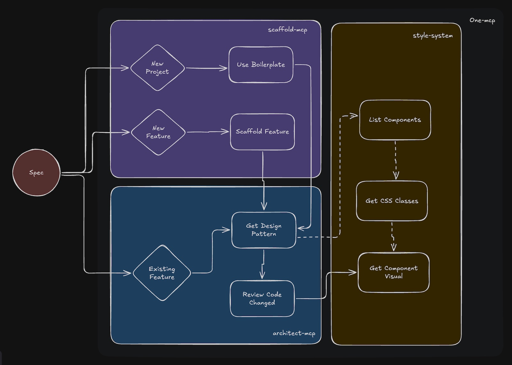

# AI Code Toolkit

[](https://www.npmjs.com/package/@agiflowai/scaffold-mcp)
[](https://opensource.org/licenses/AGPL-3.0)
[](https://discord.gg/NsB6q9Vas9)



MCP servers that teach AI coding agents your team's conventions. Provides scaffolding templates, design patterns, and style system.

---

## Why This Exists

As projects grow from MVP to production, you accumulate patterns, conventions, components, and style guides. Your `AGENTS.md` or `CLAUDE.md` keeps growing — consuming precious context window.

This toolkit encodes your team's conventions in a centralized, shareable location. Instead of preloading AI agents with documentation, our tools use **progressive discovery**: agents call tools to get relevant patterns before writing code and validate against rules after.

No more convention violations, design drift, or bloated instructions.

---

## Quick Start

**Requirements:** Node.js >= 18, MCP-compatible agent (Claude Code, Cursor, Gemini CLI)

### 1. Initialize

```bash
# Existing project
npx @agiflowai/aicode-toolkit init

# New project
npx @agiflowai/aicode-toolkit init --name my-app --project-type monolith
```

Creates `templates/` with scaffold definitions, patterns, and rules.

### 2. Configure MCP

The init command configures MCP automatically. For manual setup:

**Claude Code** (`.mcp.json`):

```json
{
  "mcpServers": {
    "scaffold-mcp": {
      "command": "npx",
      "args": ["-y", "@agiflowai/scaffold-mcp", "mcp-serve", "--admin-enable"]
    },
    "architect-mcp": {
      "command": "npx",
      "args": [
        "-y", "@agiflowai/architect-mcp", "mcp-serve",
        "--admin-enable",
        "--design-pattern-tool", "codex",
        "--review-tool", "gemini-cli"
      ]
    },
    "style-system": {
      "command": "npx",
      "args": ["-y", "@agiflowai/style-system", "mcp-serve"]
    }
  }
}
```

**Cursor**: Same config in `.cursor/mcp.json`

**Flags:**
- `--admin-enable` - Allow template creation
- `--design-pattern-tool claude-code` - AI-powered pattern analysis
- `--review-tool claude-code` - AI-powered code review

### 3. Verify

Ask your agent: *"What boilerplates are available?"*

Should call `list-boilerplates`. If not recognized, restart the agent.

---

## Architecture

```
┌─────────────────────────────────────────────────────────────┐
│                     Your AI Agent                           │
│         (Claude Code, Cursor, Gemini CLI, etc.)             │
└─────────────────────────────────────────────────────────────┘
                              │
       ┌──────────────────────┼──────────────────────┐
       ▼                      ▼                      ▼
┌─────────────┐        ┌──────────────┐       ┌─────────────┐
│ scaffold-mcp│        │ architect-mcp│       │ style-system│
│             │        │              │       │             │
│ Generates   │        │ Guides and   │       │ Design      │
│ code from   │        │ validates    │       │ system &    │
│ templates   │        │ code quality │       │ components  │
└─────────────┘        └──────────────┘       └─────────────┘
       │                      │                      │
       └──────────────────────┼──────────────────────┘
                              ▼
                    ┌─────────────────┐
                    │    templates/   │
                    │                 │
                    │ scaffold.yaml   │  ← Generation rules
                    │ architect.yaml  │  ← Design patterns
                    │ RULES.yaml      │  ← Coding standards
                    └─────────────────┘
```

### scaffold-mcp

Add new apps, libraries, or features that follow your company conventions. Generates minimal boilerplate code and uses guided generation to fill in the blanks.

| Tool | Description |
|------|-------------|
| `list-boilerplates` | Available project templates |
| `use-boilerplate` | Create project from template |
| `list-scaffolding-methods` | Available features for a project |
| `use-scaffold-method` | Add feature (page, route, service) |

**Admin tools** (`--admin-enable`):

| Tool | Description |
|------|-------------|
| `generate-boilerplate` | Create project template |
| `generate-feature-scaffold` | Create feature scaffold |
| `generate-boilerplate-file` | Add template files |

### architect-mcp

Pre-flight suggestions to ensure AI-generated code follows best practices and design patterns based on your file structure. Post-check with RULES.yaml to enforce styles and patterns using an LLM as a judge.

| Tool | Description |
|------|-------------|
| `get-file-design-pattern` | Get patterns/rules before editing |
| `review-code-change` | Validate code after editing |

**Admin tools** (`--admin-enable`):

| Tool | Description |
|------|-------------|
| `add-design-pattern` | Add to `architect.yaml` |
| `add-rule` | Add to `RULES.yaml` |

### style-system

Design system operations for theme management, CSS class discovery, and component visualization. Helps AI agents use existing design tokens and components instead of creating duplicates.

| Tool | Description |
|------|-------------|
| `list_themes` | List available theme configurations |
| `get_css_classes` | Extract CSS classes from theme (use before styling) |
| `get_component_visual` | Preview UI component without running the app |
| `list_shared_components` | Find shared UI components (use before creating new ones) |
| `list_app_components` | List app-specific and package components |

---

## Workflow

### Creating Projects

```
User: "Create a Next.js app called dashboard"

Agent:
1. list-boilerplates → finds nextjs-drizzle
2. use-boilerplate projectName:"dashboard"
3. Done: full project with patterns configured
```

### Before Editing Files

```
User: "Add a products page"

Agent:
1. get-file-design-pattern for src/app/products/page.tsx
2. Receives: patterns, must-do rules, must-not-do rules, examples
3. Writes code following patterns
```

### Adding Features

```
User: "Add a products API route"

Agent:
1. list-scaffolding-methods
2. use-scaffold-method method:"add-route" name:"products"
3. Done: route with team's boilerplate
```

### After Editing

```
Agent:
1. review-code-change for edited file
2. Gets: violations (critical/warning/suggestion)
3. Fixes violations
```

### Styling Components

```
User: "Style the button with our theme colors"

Agent:
1. get_css_classes → discovers available theme classes
2. list_shared_components → checks for existing button components
3. Applies existing classes or extends component
4. get_component_visual → previews the result
```

---

## Template Structure

```
templates/
└── nextjs-15/
    ├── scaffold.yaml      # What to generate
    ├── architect.yaml     # Design patterns
    ├── RULES.yaml         # Coding standards
    └── boilerplate/       # Template files (Liquid)
```

### scaffold.yaml

```yaml
boilerplates:
  - name: nextjs-15-app
    description: "Next.js 15 with App Router"
    targetFolder: apps
    includes:
      - boilerplate/**/*

features:
  - name: add-route
    description: "Add route with page and layout"
    variables_schema:
      name: { type: string, required: true }
    includes:
      - features/route/**/*
```

### architect.yaml

```yaml
patterns:
  - name: server-component
    description: "Default for page components"
    file_patterns:
      - "**/app/**/page.tsx"
    guidance: |
      - Use async/await for data fetching
      - Keep components focused on rendering
      - Move business logic to server actions
    examples:
      - file: examples/page.tsx
```

### RULES.yaml

```yaml
version: '1.0'
template: typescript-lib
rules:
  - pattern: src/services/**/*.ts
    description: Service Layer Implementation Standards
    must_do:
      - rule: Create class-based services with single responsibility
        codeExample: |-
          export class DataProcessorService {
            async processData(input: string): Promise<ProcessedData> {
              // Implementation
            }
          }
      - rule: Use dependency injection for composability
    must_not_do:
      - rule: Create static-only utility classes - use functions
        codeExample: |-
          // ❌ BAD
          export class Utils {
            static format(s: string) {}
          }

          // ✅ GOOD
          export function format(s: string): string {}
```

---

## Built-in Templates

| Template | Stack | Includes |
|----------|-------|----------|
| `nextjs-drizzle` | Next.js 15, App Router | TypeScript, Tailwind 4, Drizzle, Storybook |
| `typescript-lib` | TypeScript Library | ESM/CJS, Vitest, TSDoc |
| `typescript-mcp-package` | MCP Server | Commander, MCP SDK |

### Custom Templates
We suggest to build your own template from your existing repo. It's quite simple by using slash command:

``` 
/generate-boilerplate
```
Use this slash command and reference your directory to create template. This will create `scaffold.yaml` with boillerplate config and relevant files extracted from your production application.  

``` 
/generate-feature-scaffold
```
After boilerplate is generated, you can now use this command to add `feature` scaffolding. Think of feature as a group of files that generated together per your requirement (new page, new service, etc...)

The `scaffold-mcp` will automatically add this new template to the discovery.

### Custom Design Pattern
`add-design-pattern` is the tool from `architect-mcp` (with `--admin-enable` flag) that help you add a new design pattern to `architect.yaml` the template.
Simply ask the AI agent to add a design pattern to a template by giving it a source file reference.

### Custom Rule
`add-rule` is the tool from `architect-mcp` (with `--admin-enable` flag) that help you add a new rule to the `RULES.yaml` in template.
Simply ask the AI agent to add a new rule to a template by giving it a source file reference and your rule requirement. 

---

## Project Types

### Monorepo

Template reference in `project.json`:

```
my-workspace/
├── apps/
│   └── web-app/
│       └── project.json  ← { "sourceTemplate": "nextjs-15" }
├── packages/
│   └── shared-lib/
│       └── project.json  ← { "sourceTemplate": "typescript-lib" }
└── templates/
```

### Monolith

Configuration in `toolkit.yaml`:

```yaml
version: "1.0"
projectType: monolith
sourceTemplate: nextjs-15
```

Auto-detected based on config files.

---

## Token Optimization

Use `one-mcp` to reduce token usage ~90% via progressive tool discovery:

```json
{
  "mcpServers": {
    "one-mcp": {
      "command": "npx",
      "args": ["-y", "@agiflowai/one-mcp", "--config", ".mcp-servers.yaml"]
    }
  }
}
```

See [@agiflowai/one-mcp](./packages/one-mcp).

---

## Supported Agents

| Agent | Config Location | Status |
|-------|-----------------|--------|
| Claude Code | `.mcp.json` | Supported |
| Cursor | `.cursor/mcp.json` | Supported |
| Gemini CLI | `.gemini/settings.json` | Supported |
| Codex CLI | `.codex/config.json` | Supported |
| GitHub Copilot | VS Code settings | Supported |
| Windsurf | - | Coming Soon |

---

## Packages

| Package | Description |
|---------|-------------|
| [@agiflowai/aicode-toolkit](./apps/aicode-toolkit) | CLI for init and template management |
| [@agiflowai/scaffold-mcp](./packages/scaffold-mcp) | Code scaffolding server |
| [@agiflowai/architect-mcp](./packages/architect-mcp) | Patterns and review server |
| [@agiflowai/style-system](./packages/style-system) | Design system and component server |
| [@agiflowai/one-mcp](./packages/one-mcp) | MCP proxy for token reduction |

---

## Troubleshooting

**Agent doesn't recognize tools:**
1. Restart agent to reload MCP servers
2. Verify config file location
3. Test: `npx @agiflowai/scaffold-mcp mcp-serve`

**Templates not found:**
1. Run `npx @agiflowai/aicode-toolkit init`
2. Verify `templates/` exists at workspace root

**Code review missing violations:**
1. Check `RULES.yaml` exists
2. Verify file patterns match paths
3. Enable AI analysis: `--review-tool claude-code`

---

## Contributing

See [CONTRIBUTING.md](./docs/CONTRIBUTING.md).

## License

[AGPL-3.0](./LICENSE)

---

[Issues](https://github.com/AgiFlow/aicode-toolkit/issues) · [Discord](https://discord.gg/NsB6q9Vas9) · [Website](https://agiflow.io)
