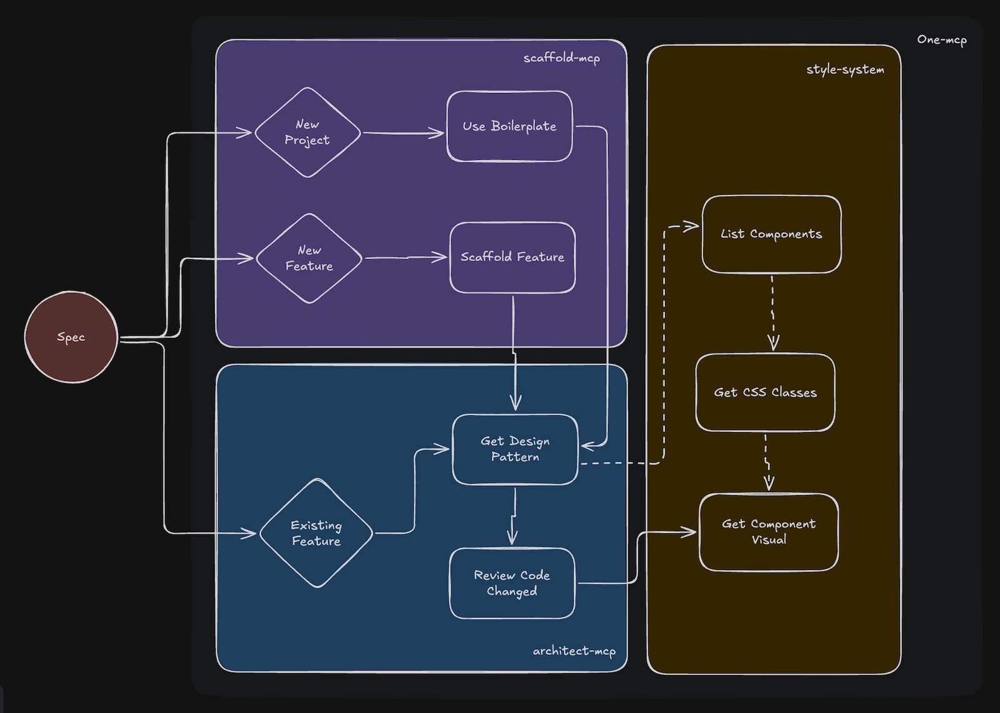

# AI Code Toolkit

[](https://www.npmjs.com/package/@agiflowai/scaffold-mcp)
[](https://opensource.org/licenses/AGPL-3.0)
[](https://discord.gg/NsB6q9Vas9)



This repo provides:
- project and feature scaffolding via templates
- file-level design guidance before edits
- rule-based review after edits
- design-system discovery for frontend work

## Why This Exists

As projects scale, conventions in docs like `CLAUDE.md`, `AGENTS.md`, and style guides become hard to keep concise and consistently applied by AI agents. This toolkit moves those conventions into reusable template configs (`scaffold.yaml`, `architect.yaml`, `RULES.yaml`) so agents can discover only the relevant guidance when needed.

## Quick Start

Requirements:
- Node.js >= 18
- an MCP-compatible agent such as Claude Code, Cursor, or Gemini CLI

### 1. Initialize a Workspace

```bash
# Existing project
npx @agiflowai/aicode-toolkit init

# New project
npx @agiflowai/aicode-toolkit init --name my-app --project-type monolith
```

This creates `templates/` and `.toolkit/settings.yaml`. Projects reference templates through `sourceTemplate` in `project.json` or `.toolkit/settings.yaml`.

### 2. Configure MCP

`init` can configure MCP automatically. For manual setup, add the servers you need to your agent config.

Example for Claude Code:

```json
{
  "mcpServers": {
    "scaffold-mcp": {
      "command": "npx",
      "args": ["-y", "@agiflowai/scaffold-mcp", "mcp-serve", "--admin-enable"]
    },
    "architect-mcp": {
      "command": "npx",
      "args": [
        "-y", "@agiflowai/architect-mcp", "mcp-serve",
        "--admin-enable",
        "--design-pattern-tool", "codex",
        "--review-tool", "gemini-cli"
      ]
    },
    "style-system": {
      "command": "npx",
      "args": ["-y", "@agiflowai/style-system", "mcp-serve"]
    }
  }
}
```

Useful flags:
- `--admin-enable`: enable admin/template-authoring tools
- `--design-pattern-tool <tool>`: use an LLM to filter design patterns
- `--review-tool <tool>`: use an LLM for review output

### 3. Verify

Ask the agent:

`What boilerplates are available?`

It should call `list-boilerplates`. If not, restart the agent.

## Repo Layout

```text
AI agent
  ├─ scaffold-mcp
  ├─ architect-mcp
  ├─ style-system
  └─ one-mcp
        ↓
     templates/
       ├─ scaffold.yaml
       ├─ architect.yaml
       └─ RULES.yaml
```

### scaffold-mcp

Generates projects and feature boilerplate from templates.

Core tools:
- `list-boilerplates`
- `use-boilerplate`
- `list-scaffolding-methods`
- `use-scaffold-method`

Admin tools:
- `generate-boilerplate`
- `generate-feature-scaffold`
- `generate-boilerplate-file`

### architect-mcp

Provides file-specific patterns before edits and reviews changes against `RULES.yaml`.

Core tools:
- `get-file-design-pattern`
- `review-code-change`

Admin tools:
- `add-design-pattern`
- `add-rule`

### style-system

Provides theme, CSS class, and component discovery tools.

Core tools:
- `list_themes`
- `get_css_classes`
- `get_component_visual`
- `list_shared_components`
- `list_app_components`

### one-mcp

Provides progressive tool discovery to reduce MCP prompt overhead.

## Typical Workflow

### Create a Project

```text
User: "Create a Next.js app called dashboard"

Agent:
1. list-boilerplates
2. use-boilerplate
3. Project is generated
```

### Add a Feature

```text
User: "Add a products API route"

Agent:
1. list-scaffolding-methods
2. use-scaffold-method
3. Feature files are generated
```

### Edit a File Safely

```text
User: "Add a products page"

Agent:
1. get-file-design-pattern
2. edit the file using the returned patterns and rules
3. review-code-change
4. fix any violations
```

### Style a Component

```text
User: "Style the button with our theme colors"

Agent:
1. get_css_classes
2. list_shared_components
3. update the component
4. get_component_visual
```

## Template Structure

```text
templates/
└── nextjs-15/
    ├── scaffold.yaml
    ├── architect.yaml
    ├── RULES.yaml
    └── boilerplate/
```

### `scaffold.yaml`

Defines boilerplates and feature scaffolds.

```yaml
boilerplates:
  - name: nextjs-15-app
    description: "Next.js 15 with App Router"
    targetFolder: apps
    includes:
      - boilerplate/**/*

features:
  - name: add-route
    description: "Add route with page and layout"
    variables_schema:
      name: { type: string, required: true }
    includes:
      - features/route/**/*
```

### `architect.yaml`

Defines file-level patterns that should be shown before edits.

```yaml
patterns:
  - name: server-component
    description: "Default for page components"
    file_patterns:
      - "**/app/**/page.tsx"
    description: |
      - Use async/await for data fetching
      - Keep components focused on rendering
      - Move business logic to server actions
```

### `RULES.yaml`

Defines review rules. Rules can be inherited from a global `templates/RULES.yaml`.

```yaml
version: '1.0'
template: typescript-lib
rules:
  - pattern: src/services/**/*.ts
    description: Service Layer Implementation Standards
    must_do:
      - rule: Create class-based services with single responsibility
        codeExample: |-
          export class DataProcessorService {
            async processData(input: string): Promise<ProcessedData> {
              // Implementation
            }
          }
      - rule: Use dependency injection for composability
    must_not_do:
      - rule: Create static-only utility classes - use functions
        codeExample: |-
          // ❌ BAD
          export class Utils {
            static format(s: string) {}
          }

          // ✅ GOOD
          export function format(s: string): string {}
```

## Project Types

### Monorepo

Each project references its template in `project.json`.

```text
my-workspace/
├── apps/
│   └── web-app/
│       └── project.json
├── packages/
│   └── shared-lib/
│       └── project.json
└── templates/
```

### Monolith

Monoliths use `.toolkit/settings.yaml`.

```yaml
version: "1.0"
projectType: monolith
sourceTemplate: nextjs-15
```

## Built-in Templates

Included templates:

| Template | Stack | Includes |
|----------|-------|----------|
| `nextjs-drizzle` | Next.js 15, App Router | TypeScript, Tailwind 4, Drizzle, Storybook |
| `typescript-lib` | TypeScript Library | ESM/CJS, Vitest, TSDoc |
| `typescript-mcp-package` | MCP Server | Commander, MCP SDK |

## Custom Templates

For template authoring, start from an existing repo or template and use the admin prompts:

```text
/generate-boilerplate
/generate-feature-scaffold
```

For design/rule authoring, use:
- `add-design-pattern`
- `add-rule`

## Supported Agents

| Agent | Config Location | Status |
|-------|-----------------|--------|
| Claude Code | `.mcp.json` | Supported |
| Cursor | `.cursor/mcp.json` | Supported |
| Gemini CLI | `.gemini/settings.json` | Supported |
| Codex CLI | `.codex/config.json` | Supported |
| GitHub Copilot | VS Code settings | Supported |
| Windsurf | - | Planned |

## Packages

| Package | Description |
|---------|-------------|
| [@agiflowai/aicode-toolkit](./apps/aicode-toolkit) | CLI for init and config sync |
| [@agiflowai/scaffold-mcp](./packages/scaffold-mcp) | Scaffolding server |
| [@agiflowai/architect-mcp](./packages/architect-mcp) | Pattern and review server |
| [@agiflowai/style-system](./packages/style-system) | Design-system server |
| [@agiflowai/one-mcp](./packages/one-mcp) | MCP proxy for progressive discovery |

## Contributing

See [CONTRIBUTING.md](./docs/CONTRIBUTING.md).

## License

[AGPL-3.0](./LICENSE)

---

[Issues](https://github.com/AgiFlow/aicode-toolkit/issues) · [Discord](https://discord.gg/NsB6q9Vas9) · [Website](https://agiflow.io)
